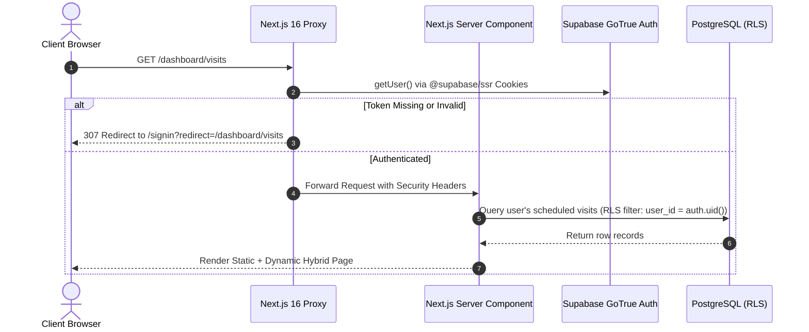

# System Architecture & Technical Specifications — PrimeHomeKanpur

---

## 1. High-Level Architecture Overview

PrimeHomeKanpur is built on a modern **Jamstack / Hybrid Serverless** architecture utilizing **Next.js 16 (App Router + Turbopack)** hosted on **Vercel Edge Network**, with **Supabase (PostgreSQL, Auth, Storage, Realtime, RLS)** as the scalable backend data layer, and **Razorpay** for payment processing.

```mermaid
graph TB
    subgraph ClientLayer["Frontend & Client Layer (Browser / Mobile)"]
        UI["Next.js React 19 Client Components"]
        Lucide["Lucide UI & Tailwind CSS v4"]
        StateCtx["Auth & Toast State Contexts"]
    end

    subgraph EdgeLayer["Edge / Server Routing Layer (Vercel)"]
        Proxy["Next.js 16 Proxy (src/proxy.ts)"]
        AppRouter["App Router (RSC & Server Actions)"]
        APIRoutes["Route Handlers (src/app/api/*)"]
    end

    subgraph DataLayer["Backend & Data Layer (Supabase PaaS)"]
        SupaAuth["Supabase GoTrue Auth (JWT + Cookies)"]
        Postgres["PostgreSQL Database with RLS"]
        SupaStorage["Supabase Storage Buckets"]
        AuditLogs["Activity Logs Table"]
    end

    subgraph ExternalServices["External APIs"]
        Razorpay["Razorpay Gateway (Orders & Webhooks)"]
        VercelCDN["Vercel Global CDN & Image Optimization"]
    end

    UI -->|HTTP / HTTPS| Proxy
    Proxy -->|Authenticated Request| AppRouter
    Proxy -->|Direct API| APIRoutes
    AppRouter -->|Server Client (@supabase/ssr)| Postgres
    AppRouter -->|Admin Client (Service Role)| Postgres
    APIRoutes -->|Order Verification| Razorpay
    UI -->|Image Uploads| SupaStorage
    UI -->|Client Auth| SupaAuth
    Postgres -->|RLS Enforcement| Postgres
```

---

## 2. Technology Stack

| Layer | Technology | Version | Purpose |
| :--- | :--- | :--- | :--- |
| **Framework** | Next.js (App Router + Turbopack) | `16.3.8` | Hybrid static/server rendering, Server Components, API routes. |
| **UI Library** | React & React DOM | `19.2.8` | Modern declarative component architecture with React 19 primitives. |
| **Language** | TypeScript | `^5.0` | Strict static typing across models, database entities, and API contracts. |
| **Styling** | Tailwind CSS & Vanilla Design System | `^4.3.3` | Custom HSL-tokenized color variables, glassmorphism, responsive grid. |
| **Icons** | Lucide React & React Icons | `^1.49.0` | Lightweight SVG icons and 3D squircle styled vectors. |
| **Form & Validation** | React Hook Form + Zod | `^7.89.0` / `^4.6.5` | Client and server-side schema validation. |
| **Database** | Supabase (PostgreSQL 15+) | Cloud | Relational database with Row Level Security, triggers, and enum types. |
| **Authentication** | Supabase Auth (`@supabase/ssr`) | `^0.12.7` | Secure cookie-based session management across edge and server. |
| **Storage** | Supabase Storage Buckets | Cloud | Multi-part uploads for property photos, floorplans, and KYC docs. |
| **Payments** | Razorpay Gateway | REST API | Secure INR payment creation and HMAC-SHA256 signature verification. |
| **Deployment** | Vercel Edge Platform | `CLI 62.1.0` | Global serverless execution, instant invalidation, automated CI/CD. |

---

## 3. Directory & Module Organization

```
PrimeHomeKanpur-Project/
├── .env.example                  # Environment variable schema template
├── .env.local                    # Private local environment secrets (gitignored)
├── .npmrc                        # CI build optimization config
├── eslint.config.mjs             # ESLint 9 Flat Configuration
├── next.config.ts                # Next.js build config & security headers
├── package.json                  # Dependencies & scripts
├── tsconfig.json                 # TypeScript compiler options
│
├── public/                       # Static public assets (images, icons, favicons)
│
├── src/
│   ├── proxy.ts                  # Next.js 16 Edge Proxy (auth & security headers)
│   ├── app/                      # Next.js App Router (68 routes)
│   │   ├── layout.tsx            # Root HTML layout with SEO metadata & providers
│   │   ├── page.tsx              # Homepage (Hero, Listings, Locality Marquee, Stats)
│   │   ├── globals.css           # Design tokens, variables & utility classes
│   │   │
│   │   ├── (public pages)/       # /about, /services, /faq, /contact, /agents, /terms
│   │   ├── rentals/              # /rentals (search/filter) & /rentals/[slug] (details)
│   │   ├── (auth)/               # /signin, /signup, /forgot-password, /reset-password
│   │   │
│   │   ├── dashboard/            # Tenant Portal (/visits, /wishlist, /applications, etc.)
│   │   ├── landlord/             # Landlord Portal (/properties, /leads, /visits, /payments)
│   │   ├── admin/                # Super Admin Panel (/properties, /users, /reports, /activity)
│   │   │
│   │   └── api/                  # REST Route Handlers
│   │       ├── contact/          # Public contact form submission
│   │       ├── newsletter/       # Newsletter subscription & unsubscribe
│   │       ├── payments/         # Razorpay create-order & verify
│   │       ├── properties/report/# Property violation report intake
│   │       └── admin/activity/   # Super admin activity audit querying
│   │
│   ├── components/               # Modular UI Component Library
│   │   ├── admin/                # Admin Topbar, Sidebar, Table, ConfirmDialog, ImageUploader
│   │   ├── auth/                 # GuestAuthModal
│   │   ├── cards/                # PropertyCard, AgentCard, LocationAreaCard
│   │   ├── home/                 # HomeSearchSection, LocalityMarquee
│   │   ├── layout/               # Header, Footer, MobileBottomBar
│   │   ├── modals/               # BookVisitModal, ReportListingModal, WriteReviewModal
│   │   ├── properties/           # PropertyDetailClient, PropertyMediaViewer, LocalityHubClient
│   │   ├── providers/            # ClientProviders (Toast, Auth, Theme)
│   │   └── ui/                   # Button, Input, Select, Badge, FaqItem, SquircleIcons
│   │
│   ├── contexts/                 # React Contexts (AuthContext)
│   ├── lib/                      # Core Utilities & Services
│   │   ├── activity.ts           # Audit log dispatcher
│   │   ├── rateLimit.ts          # In-memory token bucket rate limiter
│   │   ├── permissions.ts        # RBAC privilege evaluator
│   │   ├── utils.ts              # Formatting & class merging
│   │   ├── data/                 # Canonical data (mock properties, localities, FAQs)
│   │   └── supabase/             # Client, Server, and Admin Supabase instances
│   │
│   └── types/                    # TypeScript Data Contracts (index.ts, admin.ts)
│
└── supabase/                     # Database Migrations & Seeds
    ├── FINAL_SUPABASE_SETUP.sql  # Master database provisioning script
    ├── COMPLETE_ADMIN_AND_PERMISSIONS_FIX.sql
    ├── seed.sql                  # Seed data for properties, locations, and agents
    └── migrations/               # Sequential incremental SQL migration history
```

---

## 4. Data Flow & Authentication Lifecycle



---

## 5. Database Schema & Relational Map

The database is built on PostgreSQL with strict foreign keys, cascade rules, and automated timestamp triggers:

1. **`profiles`**: User identities, roles (`user`, `landlord`, `agent`, `admin`), phone, avatars, KYC status.
2. **`properties`**: Comprehensive real estate listings (title, slug, BHK, price, deposit, furnished, amenities, coordinates, verification status, media URLs).
3. **`visits`**: Scheduled physical/virtual visits linked to `property_id` and `user_id`.
4. **`inquiries`**: Lead inquiries submitted by prospective tenants.
5. **`wishlists`**: User bookmarked properties.
6. **`reviews`**: Verified tenant feedback, star ratings, and moderation flags.
7. **`activity_logs`**: System-wide administrative audit trail.
8. **`property_reports`**: User-submitted violation complaints.
9. **`newsletter_subscribers`**: Email mailing list with unsubscribe tokens.
10. **`payment_transactions`**: Razorpay order tracking, payment IDs, and verification receipts.
