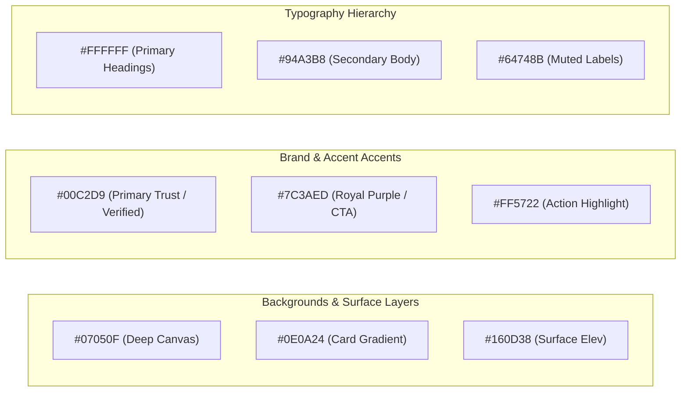

# Design System & UI/UX Guidelines — PrimeHomeKanpur

---

## 1. Visual Philosophy & Identity

PrimeHomeKanpur combines **modern dark-mode glassmorphism**, **vibrant neon accents**, and **curated spatial depth** to convey high trust, verified security, and effortless rental navigation.

### Core Visual Tenets:
1. **Deep Midnight Elevation**: Rich, layered dark backgrounds (`#07050F`, `#0E0A24`, `#160D38`) rather than flat generic blacks.
2. **Luminous Cyan & Violet Accents**: Neon Cyan (`#00C2D9`, `#22D3EE`) signifies verification and trust; Royal Violet (`#7C3AED`, `#8B5CF6`) delivers premium elegance.
3. **Glassmorphic Tactility**: 1px subtle white borders (`border-white/10` to `border-white/20`), backdrop blurs (`backdrop-blur-xl`), and multi-layer drop shadows.
4. **Mobile-First Ergonomics**: Dedicated sticky bottom navigation bar (`MobileBottomBar.tsx`), thumb-friendly action buttons (minimum 48px touch targets), and horizontal swipeable category chips.

---

## 2. Color Palette & Design Tokens



### 2.1 CSS Custom Tokens (`globals.css` & `tokens.css`)

```css
:root {
  --bg-main: #07050F;
  --bg-card: #0E0A24;
  --bg-elevated: #160D38;
  
  --primary: #00C2D9;
  --primary-glow: rgba(0, 194, 217, 0.4);
  --accent-purple: #7C3AED;
  --accent-pink: #EC4899;
  --accent-amber: #F59E0B;
  
  --text-primary: #FFFFFF;
  --text-secondary: #94A3B8;
  --text-muted: #64748B;
  
  --border-subtle: rgba(255, 255, 255, 0.08);
  --border-focus: rgba(0, 194, 217, 0.5);
  
  --radius-sm: 8px;
  --radius-md: 12px;
  --radius-lg: 16px;
  --radius-xl: 24px;
}
```

---

## 3. Typography Hierarchy

- **Primary Font Family**: `Inter`, sans-serif (Google Fonts)
- **Heading Line Heights & Weights**:
  - **H1 (Hero Title)**: `text-3xl sm:text-5xl md:text-6xl lg:text-[4.5rem]`, font-extrabold (`800`), tracking-tight (`-0.03em`), line-height `1.05`.
  - **H2 (Section Headings)**: `text-2xl sm:text-3xl md:text-4xl`, font-extrabold (`800`).
  - **H3 (Card Titles)**: `text-base sm:text-lg`, font-bold (`700`).
  - **Body Text**: `text-sm sm:text-base`, text-secondary (`#94A3B8`), leading-relaxed (`1.6`).
  - **Badges & Labels**: `text-[10px] sm:text-xs`, font-bold, uppercase tracking-wider (`0.05em`).

---

## 4. UI Component Library & Visual Patterns

### 4.1 3D Squircle Icons (`SocialSquircleIcons.tsx`, `Service3DIcons.tsx`)
- High-depth squircle icon containers with dual gradient illumination and glossy overlay effects.

### 4.2 Property Card (`PropertyCard.tsx`)
- **Aspect Ratio**: 4:3 high-res photo container with hover zoom animation (`scale-105` duration 500ms).
- **Badge Overlays**:
  - `For Rent` pill (Crimson tint: `#FFE4E6` on `#E11D48`).
  - `Featured` / `Verified` pill (Cyan gradient: `#00C2D9` on `#04121a`).
- **One-Tap Wishlist Heart**: Floating glassmorphic circular button with active pop micro-animation.
- **Spec Highlights**: Price in INR with formatted commas, BHK tag, carpet area, tenant suitability badge.

### 4.3 Buttons & Interactive States
- **Primary CTA (`.btn.orange`, `.btn-loop-shine`)**: Gradient background with an infinite glowing shimmer animation loop traversing across the button face.
- **Secondary Ghost CTA (`.btn.dark`)**: Deep surface background with 1px border and hover border glow.
- **Active Scaling**: `active:scale-[0.98]` applied across all actionable buttons for physical tactile response.

### 4.4 Mobile Experience & Bottom Navigation (`MobileBottomBar.tsx`)
- Dedicated 4-item sticky bottom bar on mobile screens:
  1. **Explore** (Search & Listings)
  2. **Saved** (Wishlist with live counter)
  3. **Visits** (Scheduled appointments)
  4. **Account** (Profile / Signin)
- Ensures effortless one-handed thumb navigation.
