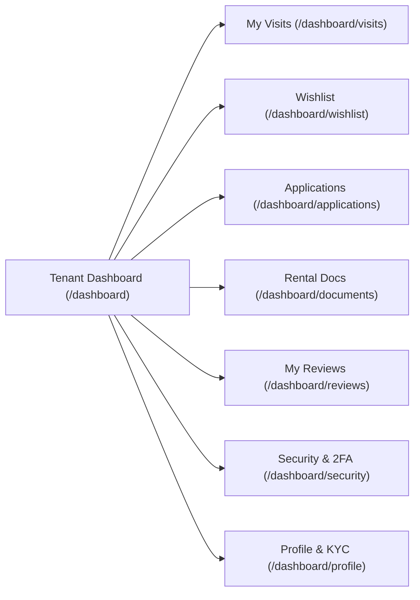
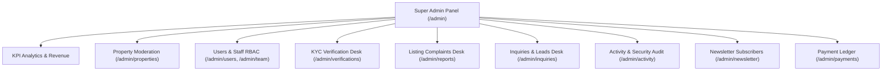

# Comprehensive Feature Matrix — PrimeHomeKanpur

---

## 1. Public Marketplace & Tenant Discovery

### 1.1 Homepage & Hero Discovery Engine
- **Unified Multi-Filter Search Bar**:
  - Locality Selector (Kakadeo, Swaroop Nagar, Civil Lines, Kalyanpur, Gurudev Chauraha, Barra, Kidwai Nagar, Vikas Nagar, Awas Vikas, etc.).
  - BHK Filter (1 BHK, 2 BHK, 3 BHK, 4+ BHK).
  - Price Bracket Selector (Under ₹10k, ₹10k–₹20k, ₹20k–₹30k, Above ₹30k).
  - Tenant Preference (Family, Bachelor, Professional, Any).
- **Locality Marquee Showcase**: Continuous hardware-accelerated marquee displaying Kanpur's top localities with active listing counts and one-click filtering.
- **Animated Performance Counters**: Live statistical counters (Verified Reviews, Years Experience, Rentals Listed, Satisfaction Rate).
- **Featured Listings Showcase**: Dynamic grid of curated, physically verified rental properties with badge overlays.
- **3D Squircle Services Grid**: Interactive cards detailing Physical Verification, Zero-Brokerage options, Legal Agreements, and Move-In Support.

### 1.2 Rentals Marketplace (`/rentals`)
- **Real-Time Client & Server Search**: Multi-faceted filter with live URL state synchronization (`/rentals?location=Kakadeo&bhk=2&price=10k-20k`).
- **Sorting Mechanisms**: Sort by Newest, Price (Low to High), Price (High to Low), and Verified Score.
- **Interactive Map / Locality Hubs**: Regional landing hubs for specific neighborhoods with commute times and neighborhood ratings.

### 1.3 Property Detail Experience (`/rentals/[slug]`)
- **High-Definition Media Viewer**: Multi-image gallery with responsive grid, thumbnail strip, lightbox modal, and video walkthrough support.
- **Key Specifications**: Monthly Rent, Security Deposit, Maintenance Charges, Floor Level, Carpet Area, Furnishing Status, Facing Direction, Available Date.
- **Verified Badges**: Green physical verification stamp, owner-direct verification marker, and agent credential tags.
- **Amenity Matrix**: Grouped badges for Power Backup, Car Parking, 24/7 Water, Lift, High Security/CCTV, WiFi, Modular Kitchen, Balcony, etc.
- **Instant Booking Engine**:
  - Physical On-Site Visit scheduler with date picker, preferred morning/evening time slots, and special requests.
  - Virtual Video Tour scheduling option.
- **Direct Owner / Agent Contact**: One-tap WhatsApp chat and phone call buttons with pre-filled property reference codes.
- **Report Listing Modal**: Community safety tool allowing tenants to flag outdated info, incorrect pricing, or fraudulent behavior.
- **Tenant Review Module**: Star rating breakdown, verified renter badge, review submission with text feedback.

---

## 2. Authenticated Tenant Dashboard (`/dashboard`)

- **Overview Hub**: Quick view of upcoming visits, active tenancy applications, and saved properties.
- **Visit Tracking (`/dashboard/visits`)**: Status pipeline (`Pending Confirmation` ➔ `Confirmed` ➔ `Completed` ➔ `Cancelled`) with visit reschedule capability.
- **Saved Wishlist (`/dashboard/wishlist`)**: Live synchronization of bookmarked properties with quick remove and direct visit booking.
- **Rental Applications (`/dashboard/applications`)**: Stage-by-stage tracker for rental applications submitted to landlords.
- **Document Locker (`/dashboard/documents`)**: Secure storage for signed rental agreements, rent receipts, and KYC verification copies.
- **Security & Privacy (`/dashboard/security`)**: Password change, active device session review, and two-factor authentication controls.

---

## 3. Landlord & Property Owner Portal (`/landlord`)

### 3.1 Overview & Cashflow Analytics (`/landlord`)
- **KPI Metrics**: Active Listings count, Total Inquiries, Scheduled Visits this week, Estimated Monthly Rental Yield.
- **Recent Leads Table**: Quick actions to reply, call, or archive prospective tenant inquiries.

### 3.2 Property Onboarding & Listing Management (`/landlord/properties`)
- **Multi-Step Creation Wizard (`/landlord/properties/new`)**:
  - Title, description, slug auto-generation.
  - Granular pricing (Rent, Security Deposit, Maintenance, Brokerage terms).
  - Physical specifications (Locality, Address, BHK, Bathrooms, Balconies, Floor, Total Floors, Carpet Area).
  - Amenity selector (25+ granular amenities).
  - Photo upload with drag-and-drop integration to Supabase Storage.
- **Listing Status Manager**: Instant toggles (`Available`, `Rented Out`, `Under Review`, `Inactive`).

### 3.3 Leads, Inquiries & Visits (`/landlord/leads`, `/landlord/visits`)
- **Tenant Lead Inbox**: Contact info, tenant type (Student, Family, Corporate), requested move-in date, message thread.
- **Appointment Manager**: Approve, reject, or propose alternate visit timings for tenant visit requests.

### 3.4 Payments & Documents (`/landlord/payments`, `/landlord/documents`)
- **Rent Invoices & Payment Ledger**: Track tenant rent payments, security deposits, and outstanding dues.
- **Digital Rental Agreements**: Upload and manage lease agreements and tenant police verification acknowledgments.

---

## 4. Admin Super-Panel (`/admin`)

- **Executive Analytics**: Real-time stats across all properties, tenants, landlords, and agents.
- **Property Moderation**: Review submitted properties, toggle physical verification status, assign verified badges, or request revisions.
- **User & RBAC Controls**: Promote users to `agent`, `landlord`, or `admin`; suspend problematic accounts.
- **Verification Desk**: Review Aadhaar/Govt ID and property ownership documents submitted by landlords.
- **Reports & Safety Center**: Review user-submitted violation reports, inspect flagged listings, and take disciplinary actions.
- **Activity & Security Audit Trail**: Real-time queryable audit logs recording all administrative actions.
- **Newsletter & Marketing Center**: Manage subscribers and export subscriber lists.

---

## 5. Security & Legal Infrastructure
- **Cookie Consent Banner (`CookieConsentBanner.tsx`)**: GDPR & Indian Digital Personal Data Protection (DPDP) compliant cookie banner with customizable preferences.
- **Comprehensive Legal Suite**:
  - Privacy Policy (`/privacy-policy`)
  - Terms of Service (`/terms`)
  - Refund Policy (`/refund-policy`)
  - Verification & Safety Policy (`/verification-policy`)
  - Disclaimer (`/disclaimer`)
- **Rate Limiting Engine (`rateLimit.ts`)**: In-memory token bucket rate limiting on sensitive API endpoints (Contact, Newsletter, Report, Payments).
