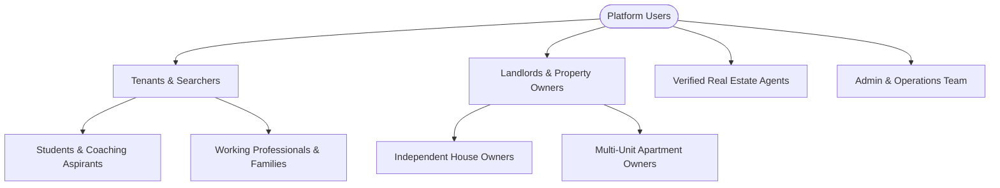

# Product Requirements Document (PRD) — PrimeHomeKanpur

---

## 1. Executive Summary
**PrimeHomeKanpur** (`https://primehomekanpur.vercel.app/`) is Kanpur's premier, verified rental housing marketplace and property management platform. Designed specifically for the Kanpur urban region (Kakadeo, Swaroop Nagar, Civil Lines, Kalyanpur, Gurudev Chauraha, Barra, Kidwai Nagar, Vikas Nagar, Awas Vikas, etc.), the platform bridges the trust deficit between tenants, property owners (landlords), and verified real estate agents through 100% physical on-ground verification, verified badge guarantees, instant visit scheduling, transparent deposit policies, and direct landlord-tenant communication.

---

## 2. Problem Statement & Market Opportunity

### 2.1 The Rental Problem in Kanpur
- **Fake & Stale Listings**: Generic aggregator portals list unverified, expired, or non-existent flats.
- **Brokerage Exploitation**: Tenants face exorbitant brokerage fees with zero accountability or post-move-in support.
- **Student & Bachelor Discrimination**: Kanpur houses major coaching hubs (Kakadeo) and universities (IIT Kanpur, CSJMU, HBTU), yet students face harassment and sudden deposit deductions.
- **Landlord Screening Burden**: Property owners lack systematic verification, tenant screening, rent collection records, and lead management tools.

### 2.2 The PrimeHomeKanpur Solution
- **100% Physically Verified Listings**: Dedicated on-ground team verifies dimensions, water/electricity supplies, parking, security, and photos before listing.
- **Role-Based Portals**: Tailored interfaces for Public Visitors, Authenticated Tenants, Property Owners (Landlord Portal), and Administrators (Admin Super-Panel).
- **Instant Physical & Virtual Visit Booking**: Integrated appointment scheduler with automated status tracking.
- **Transparent Fee & Deposit Protection**: Clear terms, documented visit fees, and verified landlord credentialing.

---

## 3. User Personas & Target Audiences

### 3.1 Tenant (Student / Family / Working Professional)
- **Goal**: Find clean, safe, verified rental accommodation near target coaching centers, universities, or business districts without broker fraud.
- **Key Needs**: Fast filters (BHK, price, furnished status, bachelor-friendly), real high-res images, video tours, precise locality info, verified badges, instant visit bookings.

### 3.2 Landlord / Property Owner
- **Goal**: List vacant apartments/rooms, receive pre-screened inquiries, manage scheduled visits, and track rental agreements.
- **Key Needs**: Easy property onboarding wizard, photo uploader, lead/inquiry dashboard, tenant visit approvals, and document management.

### 3.3 Verified Real Estate Agent
- **Goal**: Showcase curated inventory, build trust through verified badges and client reviews, and manage property viewings efficiently.
- **Key Needs**: Agent profile page, assigned property management, inquiry tracking, performance analytics.

### 3.4 Platform Administrator / Super Admin
- **Goal**: Supervise ecosystem integrity, moderate listings, review user verification documents, monitor revenue, handle listing reports, and manage staff roles.
- **Key Needs**: High-density analytics super-panel, listing approval queues, user RBAC management, activity audit trail.

---

## 4. Product Modules & Functional Specifications

### 4.1 Public Marketplace (Search, Discovery & Detail)
- **Hero Filter Bar**: Instant multi-criteria filter (Kanpur Locality, BHK Type, Budget Range, Tenant Suitability).
- **Interactive Locality Hubs**: Dedicated landing hubs for top localities (Kakadeo, Swaroop Nagar, Civil Lines, etc.) with local commute and pricing insights.
- **Property Details**:
  - High-res photo gallery with lightbox viewer and video tour playback.
  - Granular property highlights (Furnishing, Floor, Facing, Parking, Security, Deposit, Maintenance).
  - Physical visit booking modal with date/time slot picker.
  - Verified landlord/agent contact card with WhatsApp & Direct Call CTAs.
  - Report Listing modal with categorized violation reporting.
  - Verified tenant reviews and ratings.

### 4.2 Tenant Dashboard (`/dashboard`)
- **Profile & KYC**: Personal profile management and identity verification status.
- **My Visits (`/dashboard/visits`)**: Real-time status tracking of scheduled, confirmed, and completed property viewings.
- **Saved Wishlist (`/dashboard/wishlist`)**: One-click bookmarked properties synced with database.
- **Rental Applications (`/dashboard/applications`)**: Active tenancy applications and status updates.
- **Rental Documents (`/dashboard/documents`)**: Secure storage for rental agreements and payment receipts.
- **Security Settings (`/dashboard/security`)**: Password resets, 2FA readiness, and session logs.

### 4.3 Landlord Portal (`/landlord`)
- **Overview Dashboard**: High-level metrics on active listings, incoming leads, scheduled visits, and monthly rental cashflow.
- **Property Listing Wizard (`/landlord/properties/new`)**: Multi-step property creation with image upload to Supabase Storage, amenity selectors, and rent terms.
- **Listing Management (`/landlord/properties`)**: Instant toggles for property availability (`Available`, `Rented`, `Under Maintenance`).
- **Leads & Inquiries (`/landlord/leads`)**: Direct communication hub with interested prospective tenants.
- **Visit Scheduling Hub (`/landlord/visits`)**: Accept, reschedule, or complete tenant visit appointments.
- **Payments & Receipts (`/landlord/payments`)**: Rent tracking and verification payment records.

### 4.4 Admin Super-Panel (`/admin`)
- **Executive Analytics**: Real-time KPI cards (Gross Revenue, Total Properties, Active Tenants, Verified Landlords, Conversion Rates).
- **Property Moderation (`/admin/properties`)**: Review submissions, verify on-ground specs, approve/reject listings with moderator feedback.
- **User & RBAC Management (`/admin/users`, `/admin/team`)**: Role assignment (`admin`, `agent`, `landlord`, `user`), status toggles (`Active`, `Suspended`).
- **Verification Desk (`/admin/verifications`)**: Identity & property ownership document verification.
- **Listing Reports Desk (`/admin/reports`)**: User complaint triage and resolution workflows.
- **Activity & Security Audit (`/admin/activity`)**: Immutable audit logs capturing administrative actions, logins, and permission changes.

---

## 5. Non-Functional Requirements (NFRs)

| Attribute | Specification |
| :--- | :--- |
| **Performance** | Sub-second First Contentful Paint (FCP) on 4G mobile; Lighthouse Performance score ≥ 90. |
| **Reliability** | 99.9% uptime on Vercel Global Edge Network with automatic SSL & CDN caching. |
| **Data Protection** | PostgreSQL Row-Level Security (RLS) on all Supabase tables; zero plain-text passwords. |
| **SEO Optimization** | Dynamic OpenGraph metadata, JSON-LD Schema.org structured data, dynamic `sitemap.xml` & `robots.txt`. |
| **Responsive Design** | 100% mobile-first design system with dedicated mobile bottom navigation bar and touch targets ≥ 48px. |

---

## 6. Success Metrics & KPIs
1. **Listing Quality**: 100% of published listings physically verified within 24 hours of owner submission.
2. **Visit Conversion**: Over 40% of scheduled visits converting to rental agreements.
3. **User Retention**: Over 65% monthly active engagement for landlords managing occupied inventory.
4. **Zero Security Incidents**: Zero unauthorized data access through strict RLS enforcement and proxy edge protection.
