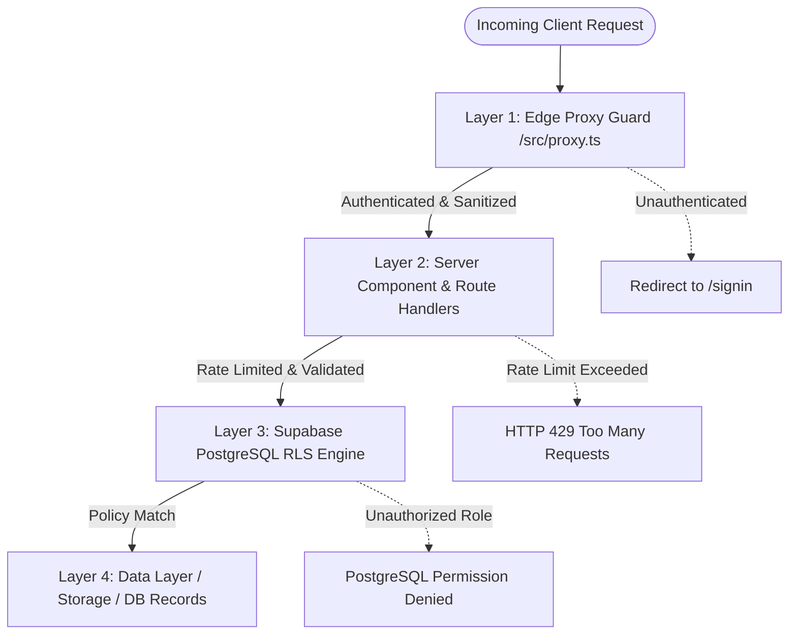

# Security Architecture & Policies — PrimeHomeKanpur

---

## 1. Multi-Layered Defense-in-Depth Architecture

PrimeHomeKanpur implements a four-tier defense model ensuring maximum protection for user identities, rental records, and financial transactions:



---

## 2. Layer 1: Edge Proxy & Session Validation (`src/proxy.ts`)

Next.js 16 Edge Proxy executes before any route renders:
1. **Cookie-Based Token Validation**: Evaluates session tokens using `@supabase/ssr` cookies.
2. **Automated Token Refresh**: Automatically refreshes expired JWT tokens without disrupting user navigation.
3. **Protected Route Enclosures**:
   - `/admin/*` — Blocks unauthenticated traffic and redirects to `/signin?redirect=/admin`.
   - `/dashboard/*` — Protects tenant portal routes.
   - `/landlord/*` — Protects landlord and property management routes.
4. **Baseline Security Headers**: Injects defensive HTTP headers on every edge response.

---

## 3. Layer 2: API Security & Rate Limiting (`src/lib/rateLimit.ts`)

All public-facing API endpoints implement IP-based token bucket rate limiting:

| Endpoint | Max Requests | Window | Purpose |
| :--- | :--- | :--- | :--- |
| `/api/contact` | 5 | 10 minutes | Prevent spam form flooding |
| `/api/newsletter/subscribe` | 5 | 1 hour | Prevent mailing list bot injection |
| `/api/properties/report` | 3 | 1 hour | Prevent malicious mass-reporting |
| `/api/payments/create-order` | 10 | 10 minutes | Prevent Razorpay order creation abuse |
| `/api/payments/verify` | 10 | 10 minutes | Prevent signature brute-force attacks |

---

## 4. Layer 3: Database Row-Level Security (RLS)

Every table in the PostgreSQL database has RLS enabled with granular policies:

### 4.1 Profiles Table
- **SELECT**: Publicly viewable for verified agent/landlord badges; private profile data restricted to profile owner or Super Admins.
- **UPDATE**: Users can only modify their own profile record (`auth.uid() = id`).
- **ADMIN OVERRIDE**: Elevated roles checked via `is_admin()` database security definer function.

### 4.2 Properties Table
- **SELECT**: Any active listing (`status = 'available' OR status = 'rented'`) is readable by public.
- **INSERT/UPDATE**: Only authenticated landlords/agents can insert/update listings where `owner_id = auth.uid()` or by Admins.

### 4.3 Visits & Inquiries Tables
- **SELECT**: Restricted to the tenant who created the visit (`user_id = auth.uid()`), the landlord who owns the property, and Admins.
- **UPDATE**: Only the property owner or Admin can change visit status (`Confirmed`, `Completed`, `Cancelled`).

### 4.4 Activity Logs Table
- **IMMUTABLE**: Append-only table for audit events. Updates and deletions are strictly restricted.

---

## 5. Layer 4: HTTP Defensive Headers (`next.config.ts` & `src/proxy.ts`)

```typescript
// Active HTTP Security Headers
{
  "X-Content-Type-Options": "nosniff",
  "X-Frame-Options": "SAMEORIGIN",
  "X-XSS-Protection": "1; mode=block",
  "Referrer-Policy": "strict-origin-when-cross-origin",
  "Permissions-Policy": "camera=(), microphone=(), geolocation=(self), browsing-topics=()"
}
```

- **X-Content-Type-Options (`nosniff`)**: Prevents MIME-type sniffing attacks.
- **X-Frame-Options (`SAMEORIGIN`)**: Completely mitigates Clickjacking by prohibiting embedding inside third-party iframes.
- **Permissions-Policy**: Restricts access to sensitive browser features (Microphone, Camera, Tracking).

---

## 6. Secrets & Environment Variable Governance
- **Zero Secrets in Codebase**: Live database passwords, Supabase Service Role keys, and Razorpay secrets are strictly excluded from source control.
- **`.gitignore` Enforced**: `.env`, `.env.local`, `.env.*.local` are permanently ignored.
- **Public vs Secret Boundary**:
  - `NEXT_PUBLIC_*`: Allowed for public client consumption (Supabase URL, Anon Key, Site URL).
  - `SUPABASE_SERVICE_ROLE_KEY`, `RAZORPAY_KEY_SECRET`: Strict server-side access only via server components/route handlers.
